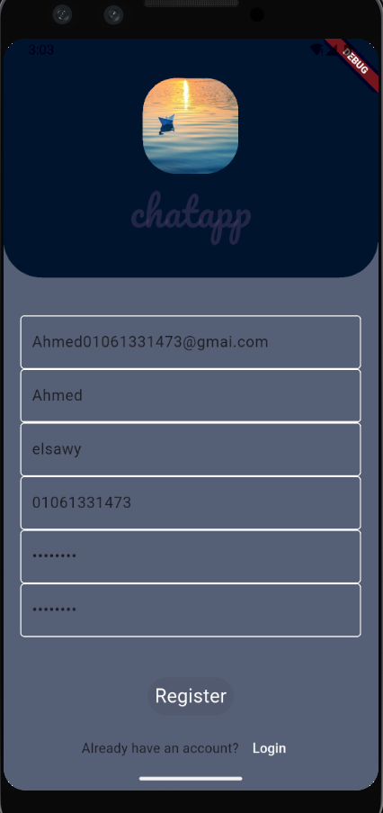
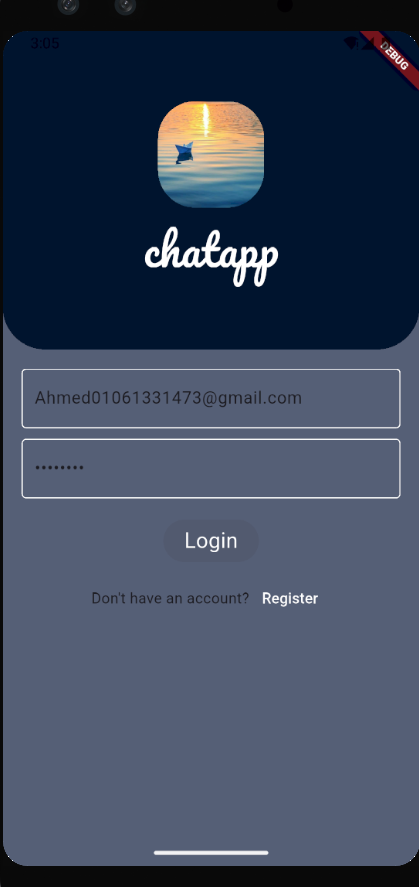

# 🎓 Graduation Project - Flutter Chat App

This is a graduation project built with **Flutter**, aiming to provide a clean and modern chat application with user authentication using **Firebase**.

## ✨ Features

- 🧑‍💻 User Registration with validation
- 🔐 Login with email and password
- 💾 Firebase Authentication integration
- 🎨 Beautiful and responsive UI for both Android and iOS
- 🔄 Reusable widgets (custom buttons & text fields)

---

## 📱 Screenshots

| Register Page | Login Page |
|---------------|------------|
|  |  |

---

## 🚀 Getting Started

1. **Clone the repository:**

```bash
git clone https://github.com/AhmedElsawy44/Graduation-project.git
cd Graduation-project
